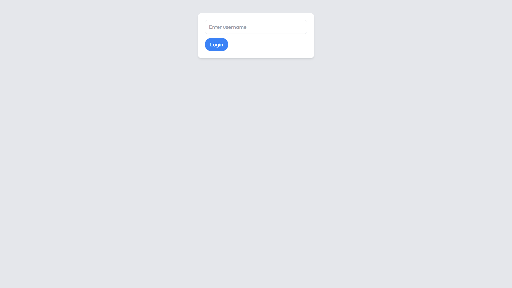
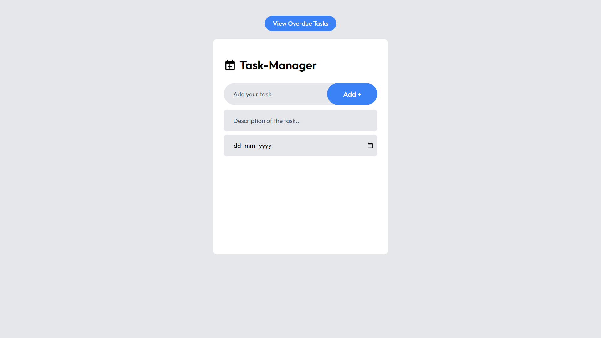
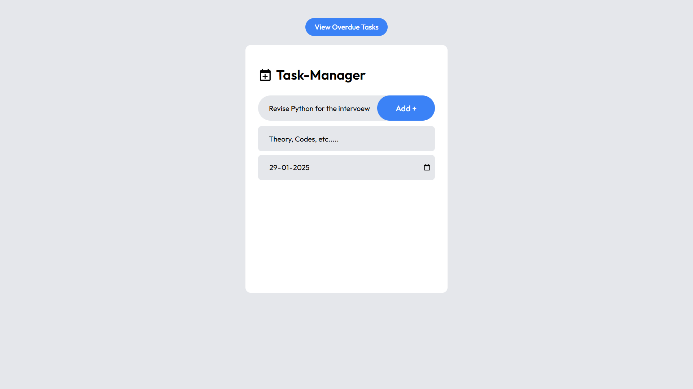
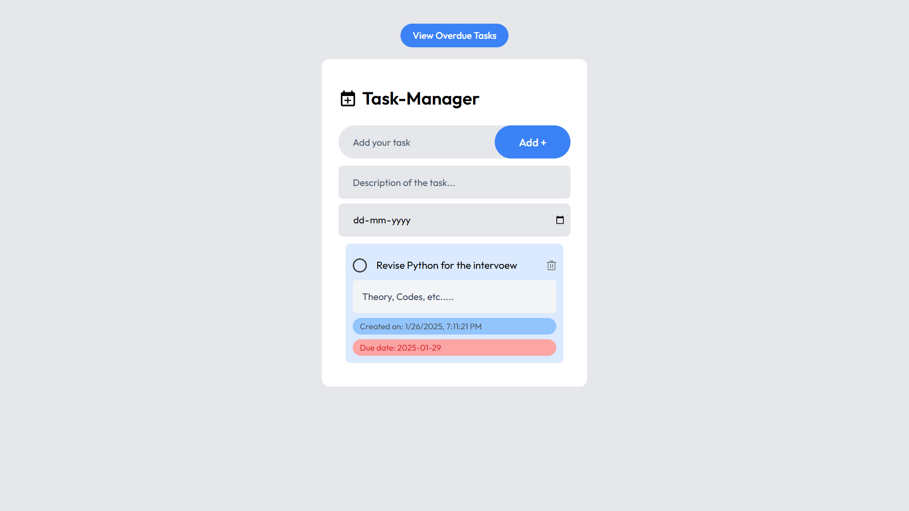
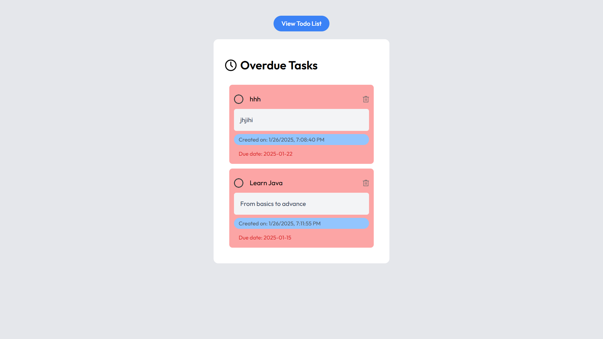

# **Task Manager with Authentication**

A responsive and feature-rich **Task Manager** application built with **React**, **Redux Toolkit**, and **localStorage**. The application allows users to manage their tasks efficiently and includes simple user authentication (login/logout functionality). Tasks are only visible to authenticated users. The project also highlights overdue tasks separately.

## **Features**
- 📝 **Add Tasks**: Add tasks with a title, description, and due date.
- ✅ **Toggle Task Completion**: Mark tasks as completed or incomplete.
- ❌ **Delete Tasks**: Remove tasks easily.
- 🔒 **Authentication**: Users must log in to access the task manager.
- 🚩 **Overdue Tasks**: View overdue tasks in a separate section.
- 💾 **Local Storage**: Persists tasks even after the page is refreshed.
- 🎨 **Responsive UI**: Optimized for desktop and mobile devices.

---

## **Screenshots**
### **Login Page**
  

### **Task Manager**
  

### **Inputs**
  

### **Active Task**
  

### **Overdue Tasks**
  

---

## **Getting Started**

### **Prerequisites**
- Node.js (v16 or above)
- npm (v8 or above)

### **Installation**
1. Clone the repository:
   ```bash
   git clone https://github.com/your-username/task-manager.git
   cd task-manager
